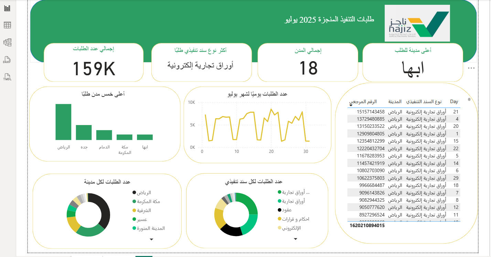
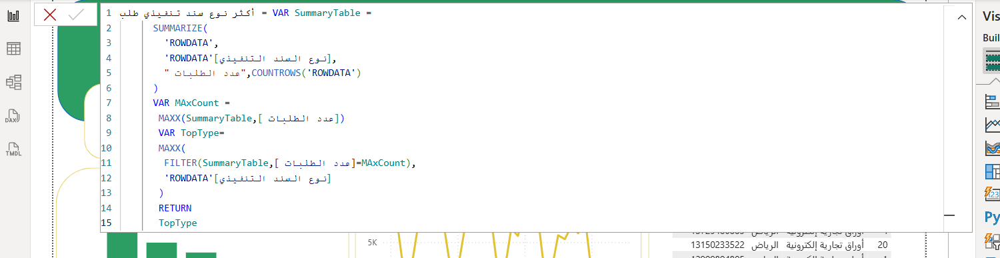

# Najiz Data Analysis

## Project Overview

Data analysis and Power BI dashboard for Najiz execution requests during July 2025.

The project focuses on analyzing execution requests by city, execution instrument type, and daily request volume to identify patterns and key insights.

## Data Source

The dataset was obtained from the Saudi Open Data Platform and is publicly available.

## Data Preparation

- Cleaned and transformed the dataset using Power Query.
- Handled missing and inconsistent values.
- Reviewed and corrected data types.
- Prepared the data for analysis and visualization.
- Created calculated measures using DAX.

## Dashboard

## DAX & Calculations

Custom DAX measures were created to support KPI development and dynamic analysis.

### Example: Most Frequent Execution Instrument

This measure identifies the execution instrument type with the highest number of requests.

## Key Insights

- 159K total execution requests were recorded during July 2025.
- Requests were distributed across 18 cities.
- Riyadh recorded the highest number of execution requests.
- Electronic commercial papers were the most frequent execution instrument type.
- Daily request volume showed noticeable variation throughout the month.

## Analysis Areas

- Total execution requests
- Requests by city
- Top cities by number of requests
- Requests by execution instrument type
- Daily request trends
- Distribution of requests across cities

## Tools & Technologies

- Power BI
- Power Query
- DAX
- Data Cleaning
- Data Visualization
- Exploratory Data Analysis

## Skills Demonstrated

- Data cleaning and transformation
- Data modeling
- KPI development
- Data visualization
- Trend analysis
- Extracting actionable insights from data
- Trend analysis
- Extracting actionable insights from data
